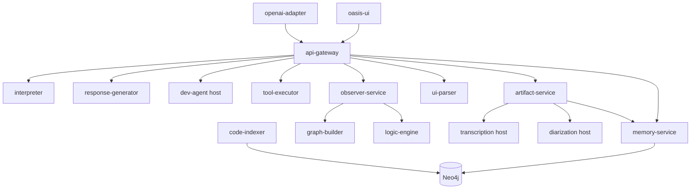

# Oasis Cognition

A full-stack AI copilot that combines **LLM-driven language and planning** with **symbolic validation**, **Neo4j graph memory**, optional **Tree-sitter code indexing**, **host-native git worktrees**, **artifact processing** (PDF/DOCX/PPTX/audio transcription), **speaker diarization**, and **computer-use** (native screen capture + automation via macOS .app bundles) for real engineering workflows. The stack includes a NestJS **api-gateway**, Python microservices (interpreter, response-generator, memory, observer, teaching, tools, artifacts, ui-parser), a React **oasis-ui**, an **OpenAI-compatible adapter**, LiveKit voice, and Langfuse observability.

**Documentation hub:** [docs/README.md](docs/README.md)

---

## What makes it stand out

- **Neuro-symbolic loop**: The **observer** runs **graph-builder** and **logic-engine** so plans and actions get structured scoring and feedback, not only next-token continuation.
- **Graph memory**: **memory-service** persists knowledge in **Neo4j** (sessions, rules, and code-symbol queries).
- **Code index in the planner**: **code-indexer** + gateway enrichment injects Neo4j-backed symbol context into tool planning (see [docs/code-indexing-service-design.md](docs/code-indexing-service-design.md)).
- **Worktrees on the host**: **dev-agent** runs outside Docker for authentic git worktrees and file tools (`./scripts/start-dev-agent.sh`).
- **Provider flexibility**: Separate env for interpreter, response, and tool-plan models — **Ollama** (default), **Anthropic**, or **OpenAI-compatible** APIs ([`.env.example`](.env.example)).
- **Observable pipelines**: **Langfuse** + streaming NDJSON UI for multi-step tool runs and thought layers.

A longer narrative: [docs/guides/what-makes-oasis-different.md](docs/guides/what-makes-oasis-different.md).

---

## Architecture (short)



**Full diagram, ports, and flow:** [docs/architecture/overview.md](docs/architecture/overview.md)  
**Historical SAD:** [docs/SAD.md](docs/SAD.md)

### Core services (Docker unless noted)

| Service | Port | Role |
|---------|------|------|
| api-gateway | 8000 | HTTP API, interaction orchestration, Redis, Langfuse hooks |
| interpreter | 8001 | NL → structured semantics / routing |
| graph-builder | 8002 | Reasoning graph construction (observer path) |
| logic-engine | 8003 | Symbolic scoring / constraints |
| memory-service | 8004 | Neo4j-backed memory and code-symbol HTTP API |
| response-generator | 8005 | Tool-plan stream, thought layer, dev-agent / executor calls |
| teaching-service | 8006 | Teaching flows, web search |
| tool-executor | 8007 | Sandboxed commands against mounted repo |
| observer-service | 8009 | Validation pipeline (graph-builder + logic-engine) |
| code-indexer | 8010 | Tree-sitter → Neo4j code graph (optional watcher) |
| ui-parser | 8011 | Deterministic UI component parser (YOLO detections + Tesseract OCR → structured UI trees) for computer-use |
| artifact-service | 8012 | Document processing (PDF, DOCX, PPTX), embeddings, transcription integration |
| openai-adapter | 8080 | OpenAI-compatible REST API (`/v1/chat/completions`, `/v1/models`) — bridges external clients to Oasis |
| voice-agent | 8090 | Voice pipeline → gateway |
| oasis-ui | 3000 | Primary web UI |
| langfuse | 3100 | Traces and dashboards |
| neo4j | 7474 / 7687 | Browser / Bolt |
| redis | 6379 | Gateway / events |
| livekit | 7880+ | Real-time AV |

**Host processes (typical):**

| Process | Port | Role |
|---------|------|------|
| Ollama | 11434 | Default LLM backend (`OLLAMA_HOST=0.0.0.0:11434` for Docker) |
| dev-agent | 8008 | Git worktrees, read/edit/patch tools |
| diarization | 8097 | Speaker diarization (PyAnnote / ONNX) via `./scripts/start-diarization.sh` |
| transcription (GIPFormer) | 8098 | Sherpa-ONNX + PyAnnote alternative via `./scripts/start-gipformer.sh` |
| transcription (MLX) | 8099 | macOS LaunchAgent via `make install` |

---

## Quick start

### Prerequisites

Docker, Docker Compose, Node 18+, Python 3.10+. **Ollama** on the host with models pulled (e.g. `ollama pull qwen3:8b` per `.env.example`).

### 1. Environment

```bash
cp .env.example .env
```

### 2. Start stack

```bash
make up
```

- **UI:** http://localhost:3000  
- **API health:** http://localhost:8000/api/v1/health  
- **Langfuse:** http://localhost:3100  

### 3. Dev agent (coding tasks)

```bash
./scripts/start-dev-agent.sh
```

### 4. Chrome Bridge extension (for computer-use)

Load the Chrome extension so computer-use can reliably extract page text from the browser. Without it, the system falls back to OCR which is slow and error-prone.

```
Chrome → chrome://extensions → Developer mode → Load unpacked → extensions/oasis-chrome-bridge
```

The extension connects to dev-agent over WebSocket. A green **ON** badge on the icon confirms the connection. See [extensions/oasis-chrome-bridge/README.md](extensions/oasis-chrome-bridge/README.md) for details.

### 5. Optional: index the repo for smarter tool plans

```bash
export OASIS_CODE_INDEXER_INDEX_ON_START=true
# optional: export OASIS_CODE_INDEXER_WATCH=true
docker compose up -d code-indexer
```

Gateway flag (default on): `OASIS_CODE_KNOWLEDGE_IN_TOOL_PLAN=true`.

**Step-by-step guide:** [docs/guides/getting-started.md](docs/guides/getting-started.md)

---

## Using the API

Main entry for chat and tool loops:

```http
POST /api/v1/interaction
Content-Type: application/json
```

(Global prefix is set in `apps/api-gateway/src/main.ts`.)

The web client targets the gateway; for custom clients, mirror the same JSON body shape the UI sends (session id, message, optional `context`).

---

## Project layout

```
oasis-cognition/
├── apps/
│   ├── api-gateway/           # NestJS gateway
│   ├── oasis-ui-react/        # Primary UI (Docker image oasis-ui)
│   └── web-client/            # Additional/legacy client assets
├── services/
│   ├── interpreter/           # NL → structured semantics / routing
│   ├── graph_builder/         # Reasoning graph construction
│   ├── logic_engine/          # Symbolic scoring / constraints
│   ├── memory_service/        # Neo4j-backed memory
│   ├── response_generator/    # Tool-plan streaming, thought layer
│   ├── teaching-service/      # Teaching flows, web search
│   ├── tool-executor/         # Sandboxed command execution
│   ├── observer-service/      # Validation pipeline
│   ├── code_indexer/          # Tree-sitter → Neo4j code graph
│   ├── ui_parser/             # YOLO + OCR UI component parser
│   ├── artifact_service/      # Document processing, embeddings
│   ├── dev_agent/             # Git worktrees, file tools (host)
│   ├── voice_agent/           # LiveKit voice pipeline
│   ├── openai-adapter/        # OpenAI-compatible REST API
│   ├── diarization/           # Speaker diarization (host)
│   ├── transcription/         # MLX-Whisper transcription (host)
│   └── transcription_gipformer/ # Sherpa-ONNX alternative (host)
├── extensions/
│   └── oasis-chrome-bridge/   # Chrome extension for computer-use page extraction
├── packages/                  # Shared types, schemas, utils
├── config/                    # LiveKit, etc.
├── docs/                      # Architecture + guides (see docs/README.md)
├── scripts/                   # Dev-agent, transcription, diarization launchers
└── docker-compose.yml
```

---

## Development

| Command | Description |
|---------|-------------|
| `make install` | Install deps (incl. macOS transcription service) |
| `make up` / `make down` | Start / stop Docker stack |
| `make logs` | Tail compose logs |
| `make status` | Service + transcription status |
| `make test` | Run tests |
| `make lint` | Linters |
| `make build` | Build artifacts |

---

## Contributing

1. Fork the repository  
2. Branch: `git checkout -b feature/your-change`  
3. Commit with clear messages  
4. Open a pull request  

Use [AGENT_GUIDELINES.md](AGENT_GUIDELINES.md) for internal contracts and debugging notes when extending agents or gateway behavior.

---

## License

MIT — see [LICENSE](LICENSE).
