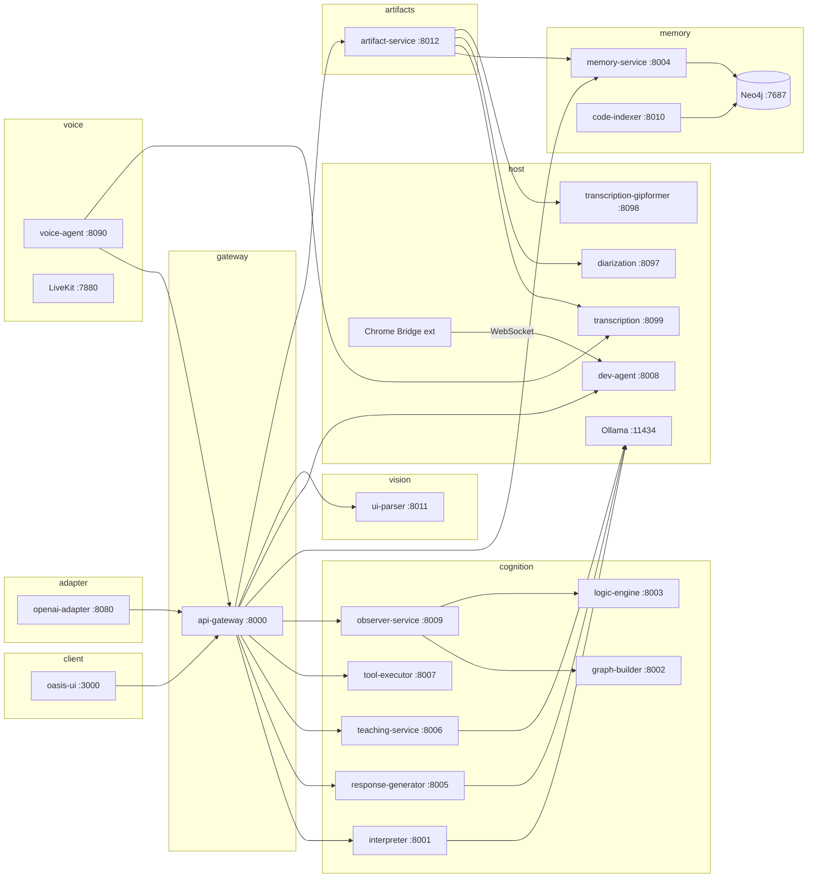

# Architecture overview

This page describes how **Oasis Cognition** runs in development: containers, native processes, and the main HTTP paths. For the original neuro-symbolic product narrative, see [SAD.md](../SAD.md). For code indexing details, see [code-indexing-service-design.md](../code-indexing-service-design.md).

## High-level diagram

## Roles of the main services

| Layer | Service | Role |
|-------|---------|------|
| Edge | **api-gateway** (NestJS) | Single public API (`/api/v1/...`). Orchestrates interpreter routing, teaching, tool-use loops, streaming NDJSON to the UI, Redis pub/sub, and optional Langfuse traces. |
| Parsing | **interpreter** | Turns natural language into structured `semantic_structure` (intent, entities, route). |
| Generation | **response-generator** | Tool-plan streaming, thought layer, validation, and calls into dev-agent / tool-executor for actions. |
| Teaching | **teaching-service** | Guided teaching flows and web search integration. |
| Execution | **tool-executor** | Sandboxed shell/npm-style execution against mounted workspace. |
| Coding | **dev-agent** (host) | Git worktrees, `read_file` / `edit_file` / `apply_patch`, and repo-local edits — runs on the host for real git access (`scripts/start-dev-agent.sh`). |
| Oversight | **observer-service** | Invokes **graph-builder** and **logic-engine** to score plans, detect contradictions, and feed structured feedback back into the loop. |
| Memory | **memory-service** | Neo4j-backed session memory, rules snapshots, code-symbol queries, and **CU learning memory** (Skill, UIElement, Action nodes for action replay and self-improvement). |
| Index | **code-indexer** | Tree-sitter indexing of the repo into Neo4j (`CodeFile`, `CodeSymbol`, `CodeModule`); optional file watcher. |
| Voice | **voice-agent** + **LiveKit** | Real-time audio; transcription may call host **transcription** (MLX) on macOS. |
| Adapter | **openai-adapter** | OpenAI-compatible REST API (`/v1/chat/completions`, `/v1/models`). Bridges external clients (e.g. Open WebUI) to the Oasis pipeline; Langfuse tracing built-in. |
| Vision | **ui-parser** | Deterministic UI component parser for the computer-use pipeline. Converts YOLO detections + Tesseract OCR into structured/hierarchical UI component trees (buttons, inputs, text, etc.). |
| Browser | **Chrome Bridge** (extension) | Manifest V3 Chrome extension connecting to dev-agent via WebSocket (`ws://localhost:8008/ws/chrome-bridge`). Provides reliable DOM text extraction, meta tag reading, navigation, and element interaction for the computer-use pipeline. Falls back to AppleScript when not installed. See `extensions/oasis-chrome-bridge/`. |
| Artifacts | **artifact-service** | File upload, document processing (PDF, DOCX, PPTX), text extraction, embedding generation, and transcription integration. Delegates metadata to memory-service (Neo4j). |
| Diarization | **diarization** (host) | Speaker diarization using PyAnnote — identifies speaker segments from audio. Runs on host via `scripts/start-diarization.sh`. |
| Transcription | **transcription-gipformer** (host) | Alternative transcription backend using Sherpa-ONNX + PyAnnote. Runs on host via `scripts/start-gipformer.sh`. Best suited for Vietnamese audio. |
| Observability | **Langfuse** + Postgres | Traces and dashboards (default port **3100** on host). |

## Typical tool-use request flow

1. Client POSTs to **`POST /api/v1/interaction`** with session id, message, and optional context (e.g. screen share metadata).
2. **Interpreter** classifies the message and emits structured semantics.
3. For **tool_use**, the gateway may enrich the tool-plan context with **Neo4j code symbols** (memory-service) before each planning hop when `OASIS_CODE_KNOWLEDGE_IN_TOOL_PLAN` is enabled.
4. **Response-generator** streams a plan; the gateway executes tools against **dev-agent** (files/worktrees) and **tool-executor** (commands).
5. **Observer** runs **graph-builder** → **logic-engine** to validate or critique progress; results influence the next iteration.

## Ports (development defaults)

| Port | Service |
|------|---------|
| 3000 | oasis-ui (nginx serving React build) |
| 3100 | Langfuse UI |
| 7474 / 7687 | Neo4j browser / Bolt |
| 6379 | Redis |
| 5433 | Langfuse Postgres (host-mapped) |
| 7880 / 7881 | LiveKit |
| 8000 | api-gateway |
| 8001 | interpreter |
| 8002 | graph-builder |
| 8003 | logic-engine |
| 8004 | memory-service |
| 8005 | response-generator |
| 8006 | teaching-service |
| 8007 | tool-executor |
| 8008 | dev-agent (**host**, not in default compose) |
| 8009 | observer-service |
| 8010 | code-indexer |
| 8090 | voice-agent |
| 8011 | ui-parser |
| 8012 | artifact-service |
| 8080 | openai-adapter |
| 8097 | diarization (**host**, `scripts/start-diarization.sh`) |
| 8098 | transcription-gipformer (**host**, `scripts/start-gipformer.sh`) |
| 8099 | transcription (native MLX when installed via `make install`) |
| 11434 | Ollama (**host**, `OLLAMA_HOST=0.0.0.0:11434` for Docker access) |

## Computer-Use learning memory

The CU agent learns from successful sessions and replays proven action sequences:

**Neo4j node types** (managed by memory-service under `/internal/memory/cu/`):

| Node | Purpose | Key properties |
|------|---------|---------------|
| `Skill` | Reusable action sequence learned from a successful CU session | `intent`, `steps` (JSON), `success_rate` (EMA), `usage_count` |
| `UIElement` | Remembered UI element position across sessions | `text`, `type`, `x_ratio`, `y_ratio`, `context`, `confidence` |
| `Action` | Individual CU action execution record | `type`, `target`, `success`, `timestamp` |

**Relationships**: `(:Skill)-[:USES]->(:UIElement)`, `(:Action)-[:TARGETS]->(:UIElement)`, `(:Action)-[:PART_OF]->(:Skill)`

**Learning loop**:
1. Cold start: LLM plans as usual (logic engine IF/THEN rules + web research)
2. Each step saves `Action` + `UIElement` nodes (fire-and-forget)
3. On success: `Skill` created from completed steps, linked to UI elements
4. Warm start: `draftPlan` queries skills first — if found (rate >= 0.75), skips LLM entirely
5. Success/failure updates `success_rate` via exponential moving average (alpha=0.3)
6. After ~3 consecutive failures, skill degrades below threshold and system falls back to LLM

The existing logic engine (IF/THEN rules, observer, graph-builder) is **not modified** — skills are a parallel shortcut layer.

## Infrastructure dependencies

- **Neo4j**: graph memory and code index nodes. Compose default credentials: user `neo4j`, password `oasis-cognition` (override via env for production).
- **Redis**: gateway event bus / session coordination.
- **Ollama**: default LLM backend for interpreter, response-generator, and teaching-service; containers use `host.docker.internal:11434` on macOS/Windows Docker Desktop.

## Related reading

- [Getting started](../guides/getting-started.md)
- [What makes Oasis different](../guides/what-makes-oasis-different.md)
- [AGENT_GUIDELINES.md](../../AGENT_GUIDELINES.md) — contracts, env flags, debugging notes
